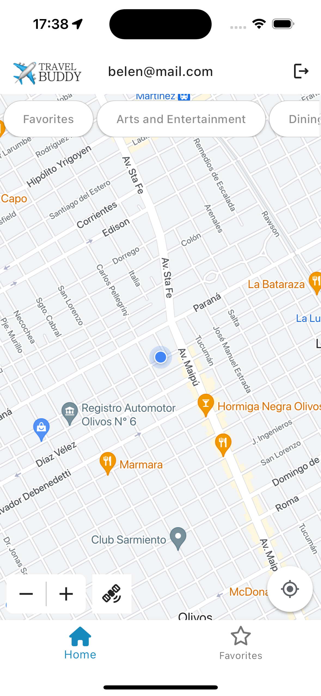
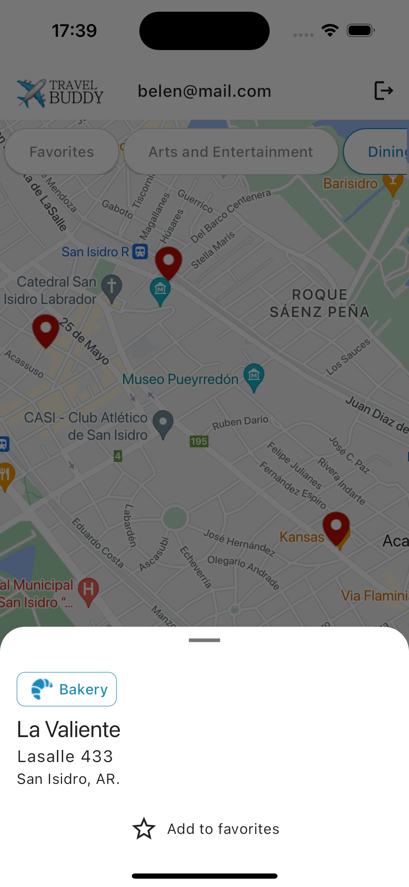
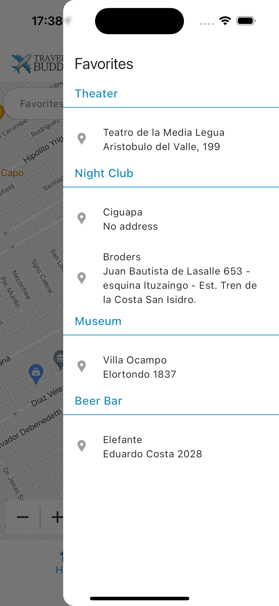

**Travel Buddy** is a Flutter app that helps users explore and mark locations on a Google Map based on Foursquare categories. The app integrates Firebase Authentication for user management and Cloud Firestore for storing user-specific favorites.

## Features

- **User Authentication**: Users can sign up and sign in using Firebase Authentication.
- **Google Map Integration**: Users can view a Google Map and mark locations based on Foursquare categories.
- **Foursquare Places API**: The app fetches places data from the Foursquare API to display options on the map.
- **Favorites Management**: Users can save marked locations as favorites, which are stored in Firebase Cloud Firestore and are specific to each authenticated user.
- **State Management**: Utilizes various state management solutions:
  - **BLoC** for authentication and Foursquare connections.
  - **GetX** for accessing Foursquare place details.
  - A **singleton** pattern for managing Firebase connections and retrieving the user's favorites.

<div style="display: flex; justify-content: space-between; align-items: center;">
  
  
  
  
</div>

## Technologies Used

- **Flutter**: SDK version `>=3.1.0 <4.0.0`
- **Firebase**: Firebase Authentication and Cloud Firestore.
- **Google Maps**: For displaying locations.
- **Foursquare API**: For accessing place data.
- **State Management**: BLoC, GetX, Singleton, Stateful widget.

## Getting Started

### Prerequisites

- Flutter SDK installed (version `>=3.1.0 <4.0.0`)
- Dart SDK
- Firebase account
- Foursquare API key

### Installation

1. Clone the repository:
   ```bash
   git clone https://github.com/belenyb/travel_buddy.git
   cd travel_buddy
   ```

2. Install the dependencies:
   ```bash
   flutter pub get
   ```

3. Configure Firebase:

- Create a Firebase project in the Firebase Console.
- Add your Flutter app to the project.
- Download the google-services.json (for Android) and/or GoogleService-Info.plist (for iOS) files and place them in the appropriate directories:
  - Android: android/app/
  - iOS: ios/Runner/

4. Set up Foursquare API:

- Sign up for a Foursquare developer account and create a new app to obtain your API key.
- Create an .env file with your Foursquare API key and place it on the root of your project.

5. Run the app:
   ```bash
   flutter run
   ```

## Usage
### Sign Up / Sign In
Launch the app and create a new account or sign in to your existing account.

### Explore Locations
Use the Google Map interface to explore nearby locations categorized by Foursquare.

### Mark Favorites
Tap on a location to mark it as a favorite. Your favorites are saved and can be accessed later.
